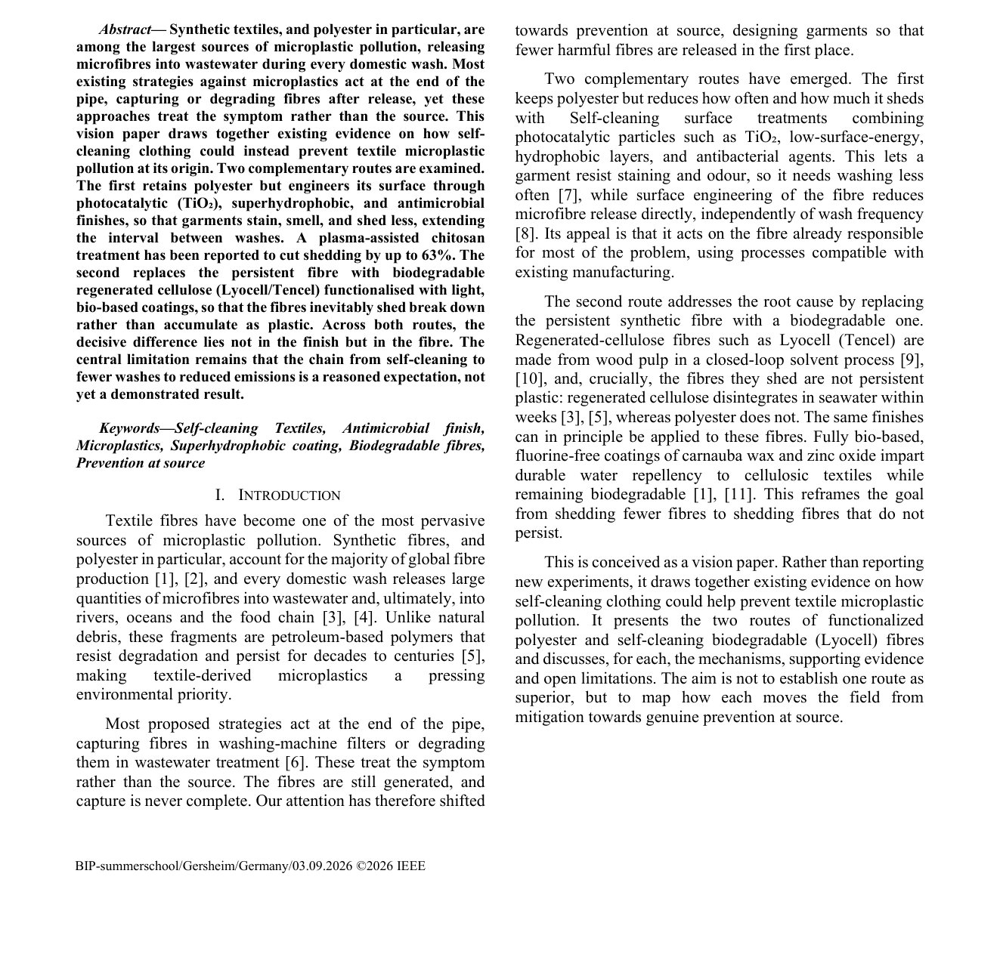
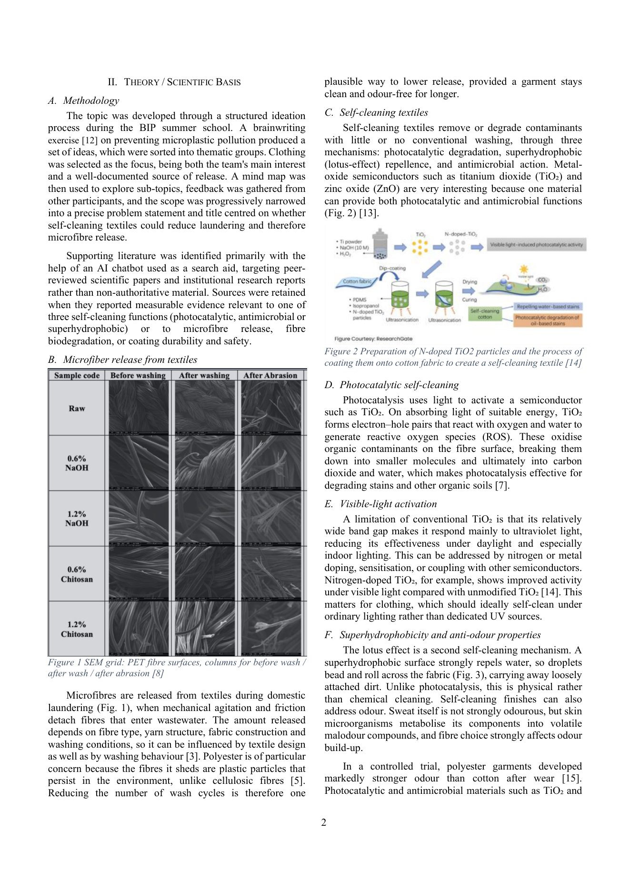

O Blended Intensive Programme **Engineering Visions 2026** da htw saar (Saarbrücken, Alemanha) juntou estudantes de toda a Europa para pensar em formas de combater microplásticos e PFAS: uma parte online e duas semanas presenciais. A minha equipa tinha seis estudantes de seis instituições — mecatrónica, química, gestão, engenharia mecânica, informática e eu, de engenharia de sistemas — e trabalhou sempre em inglês.

## O problema

Os têxteis sintéticos, sobretudo o poliéster, estão entre as maiores fontes de microplásticos: cada lavagem liberta microfibras que vão parar aos rios, ao mar e à cadeia alimentar. A maior parte das soluções atua no fim do tubo — filtros, tratamento de águas — e trata o sintoma, não a origem.

## A nossa proposta

Um _vision paper_ que reúne a evidência sobre roupa autolimpante como prevenção na origem, por duas vias:

- **Poliéster com acabamentos funcionais** — fotocatalíticos (TiO₂), super-hidrofóbicos e antimicrobianos — para a roupa sujar, cheirar e largar menos fibras, e precisar de menos lavagens.
- **Fibras biodegradáveis** (Lyocell/Tencel) com revestimentos de base biológica, para que as fibras que inevitavelmente se soltam se degradem em vez de se acumularem como plástico.

A conclusão: a diferença decisiva está na fibra, não no acabamento. E fomos honestos sobre o limite — a cadeia "autolimpante → menos lavagens → menos emissões" é uma expectativa fundamentada, ainda não um resultado demonstrado.

## Como trabalhámos

Brainwriting para gerar ideias, agrupamento por temas, mapa mental para afunilar o âmbito e feedback dos outros participantes até chegar à pergunta final. Depois, pesquisa de artigos com revisão por pares e escrita a doze mãos. No fim, apresentámos os resultados oralmente, em grupo.

