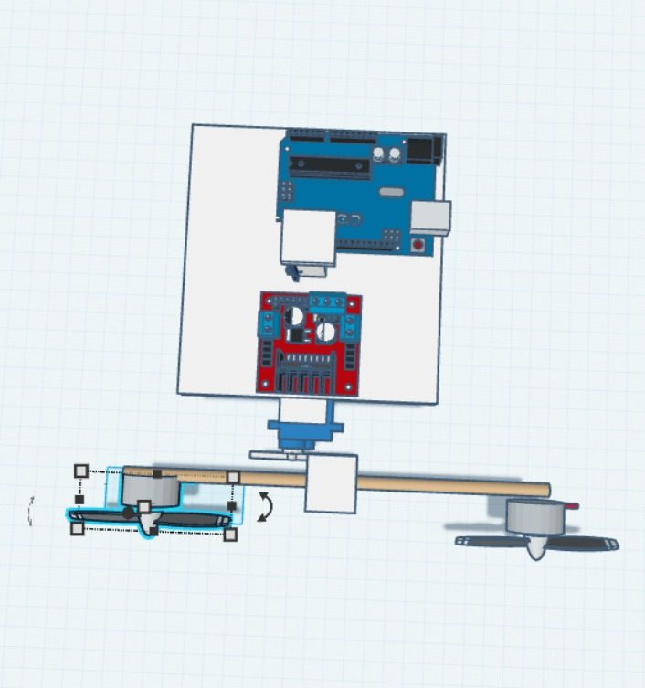
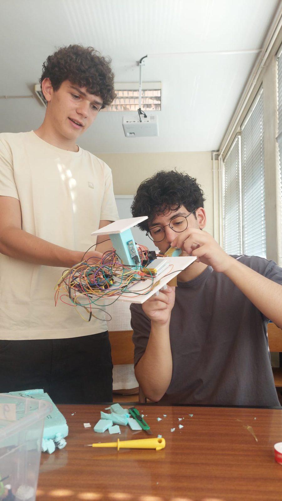
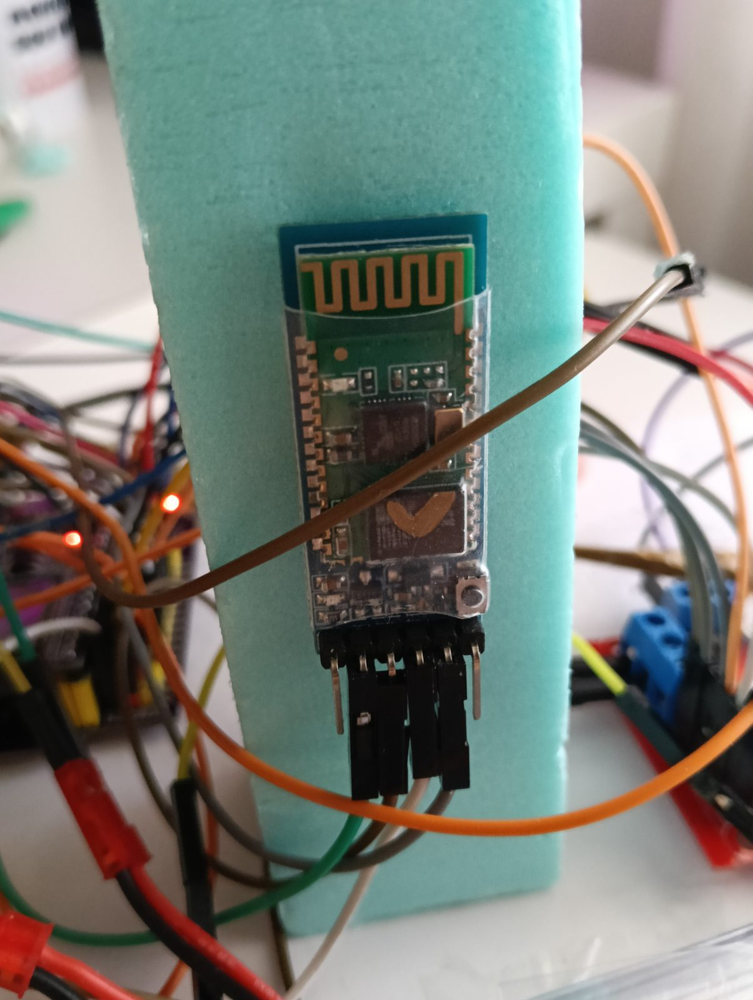
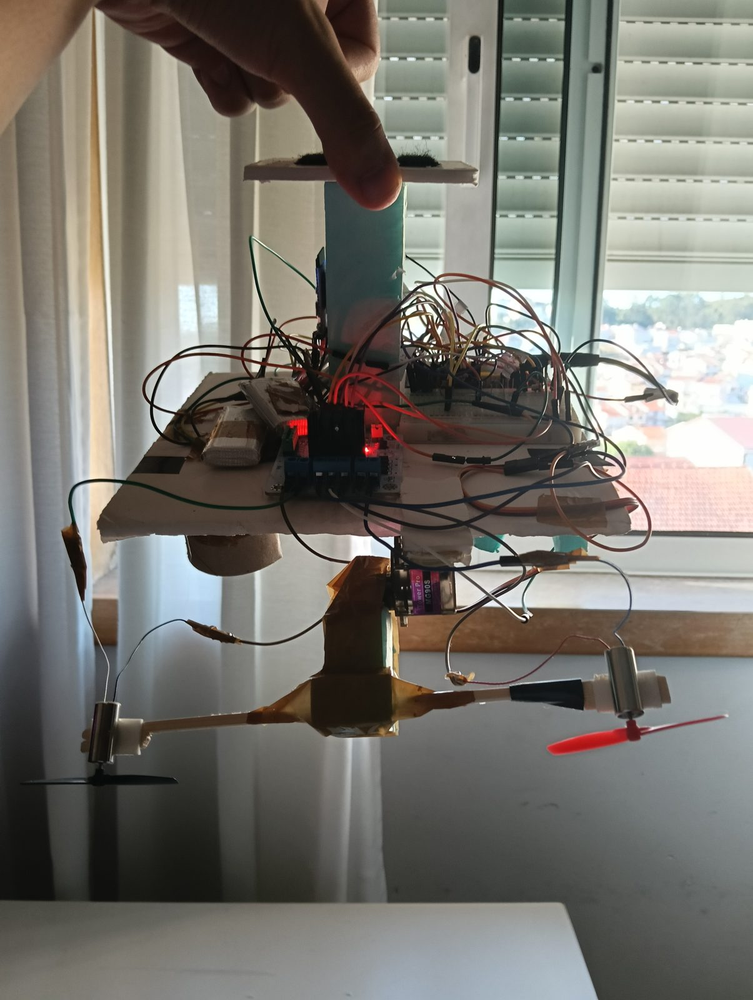

A LENG2 project in the second semester of my first year, in a team of four or five. The idea: a light platform hanging from a helium balloon, with propellers to move around.

## How it was built

We first designed everything in Tinkercad — the base with the Arduino and the motor driver, and an axle with two propellers turned by a servo to steer the thrust. Then came the real prototype, in foam and as light as possible, with an HC-05 Bluetooth module for control and an ultrasonic sensor.

Once again I did a bit of everything, from assembly to electronics and code.

## Did it go well? Sort of

We burned a motor driver and had to buy another one at the last minute. In the end the blimp **flew with its helium balloon and passed the assessment** — but it was rather clumsy. It wasn't my best project, and it taught me a lot about weight, margins and keeping spare parts.

