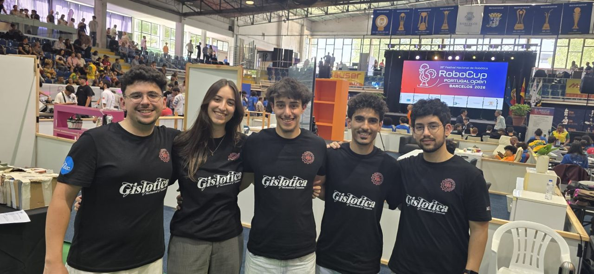
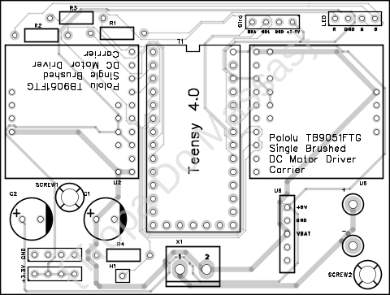
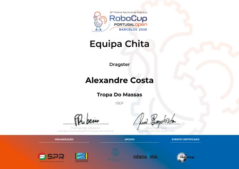

Campeonato Nacional de Robótica, categoria Dragster, pela equipa **Tropa do Massas** (sim, o nome é mesmo esse). A prova foi no 26.º Festival Nacional de Robótica — RoboCup Portugal Open, em Barcelos.

## O que fiz

- Desenvolvi o robô de raiz: esquemas elétricos, PCBs próprias para controlo e para distribuição de potência, e a montagem completa.
- Programei em C a integração dos sensores com o microcontrolador Teensy 4.0, para controlar e corrigir a trajetória em tempo real.
- Tratei da comunicação com os patrocinadores: Gislotica, Critical TechWorks e PTRobotics.

## A prova

Foram três dias de competição. Houve avarias, houve reparações de emergência entre rondas, e chegámos às finais: **8.º lugar em 16 equipas** e o **Prémio Chita**.

## Por dentro

A PCB de controlo, desenhada por mim: o Teensy 4.0 ao centro, dois drivers de motor Pololu TB9051FTG, os condensadores de alimentação e os conectores dos sensores.

## A seguir

Já estou a trabalhar na versão 2 para o Festival Nacional de Robótica 2027 — desta vez a PCB também faz de chassis.
