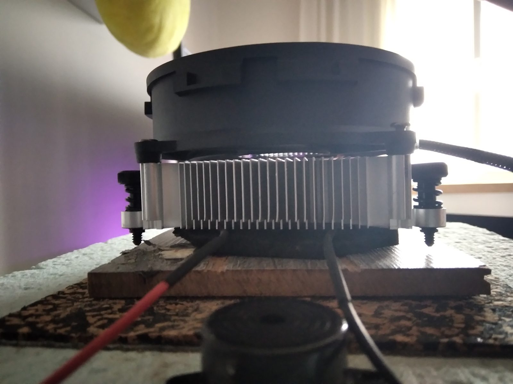
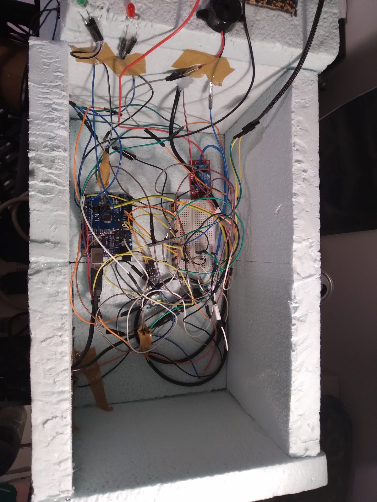
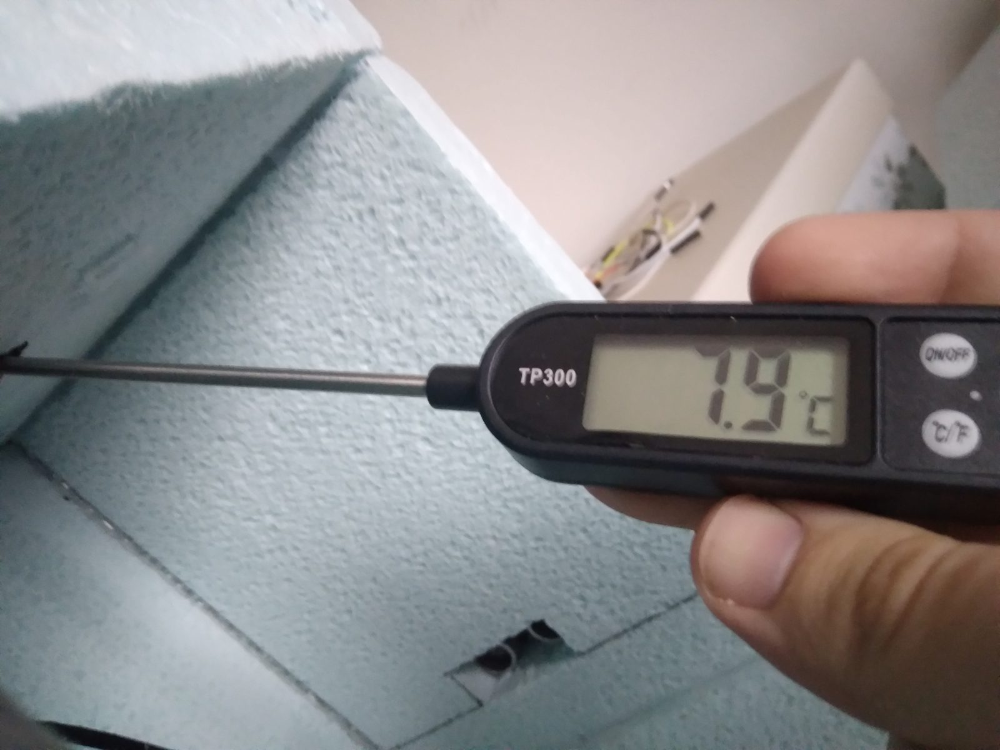

Projeto de LENG1, no 1.º semestre do 1.º ano. O desafio: arrefecer uma caixa pequena sem compressor, só com uma **célula de Peltier** — uma placa que, com corrente, aquece de um lado e arrefece do outro.

## O que fiz

Mais uma vez, um pouco de tudo: a montagem da caixa isolada, a eletrónica, os sensores de temperatura e o código de controlo — um controlo liga/desliga da célula consoante a temperatura medida.

O calor do lado quente sai por um dissipador de CPU com ventoinha, montado na tampa; cá dentro, uma ventoinha pequena espalha o frio pelo volume da caixa.

## Resultado

Com a sala a cerca de 20 °C, o interior chegou a cerca de **7,9 °C** — o mínimo que conseguimos.

