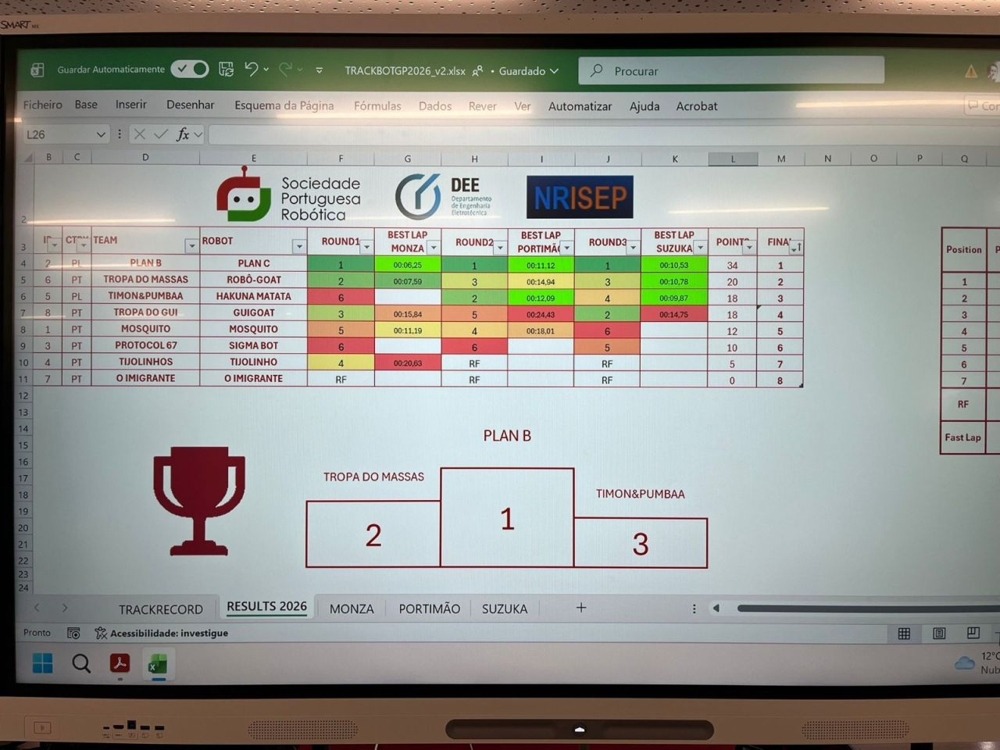

TrackBotGP at ISEP Open Robotics 2026 is a race for autonomous robots across three tracks — Monza, Portimão and Suzuka. We entered as **Tropa do Massas**, a team of four, with the **Robô-GOAT**.

## What I did

- Led the hardware and the 3D design of the structure, built to be light and aerodynamic.
- Integrated the electronics and helped with the C code and trackside debugging.

## Result

**2nd of 8 teams, with 20 points.** Our best lap was at Monza: 7.59 s. The result qualified us for the national championship — which became the [Dragster](../dragster-fnr-2026/).

Organised by the Portuguese Robotics Society (SPR), ISEP's Department of Electrical Engineering and NRISEP.
